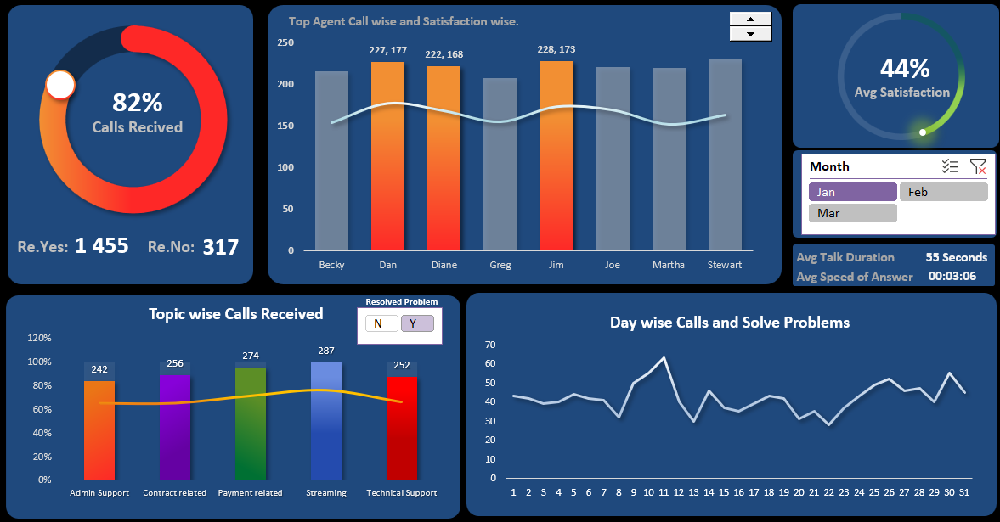

# 📊 Call Center Dashboard

J'ai développé un **tableau de bord complet pour un centre d'appels (Call Center Dashboard)** sous Excel, avec des tableaux et des visualisations modernes permettant d'analyser les données et d'obtenir des indicateurs clés de performance.

Le projet comprend les différentes étapes de **préparation, nettoyage, analyse et visualisation des données**, afin de produire des analyses pertinentes sur l'activité du centre d'appels.

---

## 📁 Jeu de données utilisé

- **Dataset :** Call Center Dataset

---

## 📈 Indicateurs clés de performance (KPI)

Le tableau de bord permet d'analyser plusieurs indicateurs, notamment :

1. Nombre d'appels et satisfaction par agent
2. Identification des meilleurs agents selon leurs performances
3. Pourcentage d'appels reçus
4. Niveau moyen de satisfaction des clients
5. Analyse des appels répondus : « Oui / Non »
6. Nombre total d'appels
7. Durée moyenne des conversations
8. Temps moyen de réponse aux appels
9. Nombre d'appels résolus par jour
10. Nombre d'appels reçus et niveau de satisfaction par sujet
11. Filtres par mois et par statut de résolution « Oui / Non »

---

## 🖥️ Interaction avec le tableau de bord

- **Tableau de bord interactif :** le dashboard intègre des **segments (Slicers)** et des **filtres dynamiques**, permettant aux utilisateurs d'explorer les données selon différents critères.
- Les utilisateurs peuvent notamment filtrer les résultats par **mois, agent, sujet de l'appel ou statut de résolution**.

---

## ⚙️ Processus de réalisation

### 🔹 Préparation des données

- Vérification approfondie du jeu de données afin d'identifier les **valeurs manquantes, anomalies et incohérences**.
- Harmonisation des **types de données, formats et valeurs** afin de garantir la qualité et l'intégrité des données.

### 🔹 Nettoyage des données

- Suppression des **doublons** et correction des erreurs identifiées dans le jeu de données.
- Standardisation des différentes valeurs afin d'améliorer la **fiabilité et la cohérence des analyses**.

### 🔹 Analyse des données

- Utilisation des **tableaux croisés dynamiques** pour agréger et analyser les données.
- Analyse des principaux KPI tels que :
  - volume d'appels ;
  - performance des agents ;
  - taux de satisfaction ;
  - taux de résolution ;
  - durée moyenne des appels ;
  - temps moyen de réponse.
- Utilisation de **formules et fonctions Excel** pour calculer les différents indicateurs de performance.

### 🔹 Visualisation des données

- Création d'un **dashboard moderne et interactif** à l'aide de différents graphiques, tableaux et indicateurs Excel.
- Regroupement des différents tableaux croisés dynamiques au sein d'un **tableau de bord centralisé**.
- Intégration de **segments (Slicers)** permettant de filtrer dynamiquement les données selon différents critères tels que le mois, l'agent ou le sujet de l'appel.

---

## 🖼️ Aperçu du tableau de bord



> **Dashboard Preview :** Vue synthétique des principaux indicateurs du centre d'appels avec filtres interactifs (Slicers) par mois, agent et sujet d'appel.

---

## 🛠️ Outils utilisés

| Outil | Usage |
|-------|-------|
| **Microsoft Excel** | Préparation, nettoyage, analyse et visualisation des données |
| **Tableaux croisés dynamiques** | Agrégation et analyse des données |
| **Graphiques Excel** | Représentation visuelle des indicateurs et tendances |
| **Slicers (Segments)** | Filtrage interactif et dynamique du tableau de bord |

---

## 📂 Structure du projet

```
📁 Calling Center Dashboard/
├── 📊 Call Center Dataset.xlsx      # Jeu de données brut
├── 📊 calling center report.xlsx    # Dashboard Excel final avec KPIs
└── 📄 README.md                     # Documentation du projet
```

---

## 👤 Auteur

Projet réalisé dans le cadre d'une analyse de données pour un centre d'appels, démontrant les compétences en **Excel, analyse de données et visualisation**.
